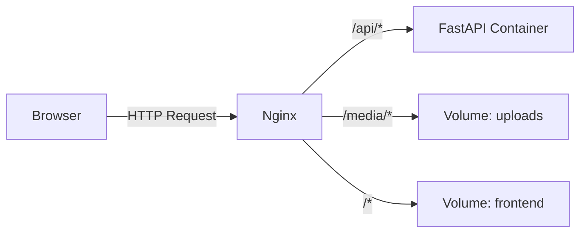

[🏠 Home](../../index.md) > [Nginx](index.md)

# 🏗️ Nginx Architecture

## Роль в системе
Nginx является единственной точкой входа (Entry Point) в приложение из внешнего мира.

Он решает три задачи:
1.  **Static Server:** Отдает Frontend (HTML, CSS, JS) и загруженные медиа-файлы (Images) напрямую с диска. Это быстрее, чем через Python.
2.  **Reverse Proxy:** Проксирует запросы, начинающиеся с `/api` или `/auth`, в контейнер с бэкендом (FastAPI).
3.  **Load Balancer (Future):** В будущем позволит запустить несколько копий бэкенда.

## Схема потоков

---
[🏠 Вернуться на главную](../../index.md)
